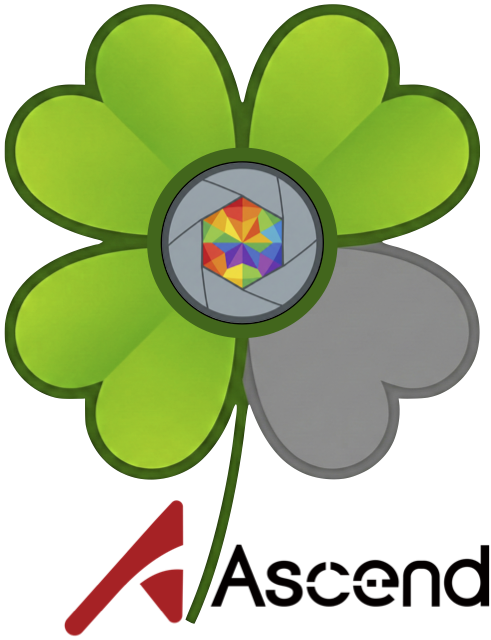
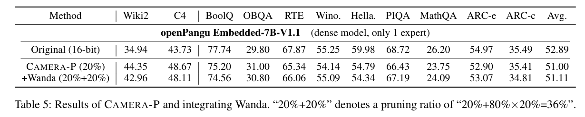
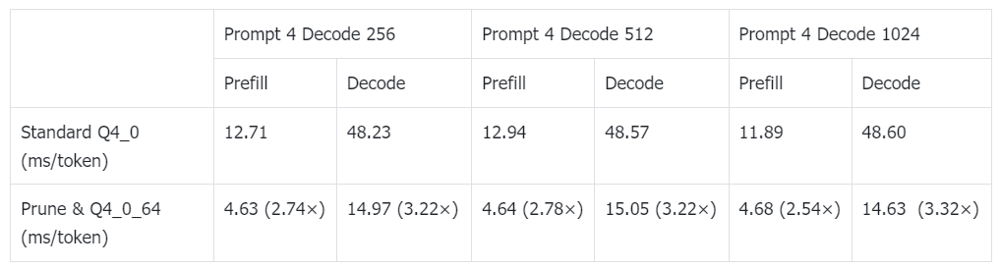

# 🍀CAMERA: Multi-Matrix Joint Compression on Ascend NPU

<div align="center">
  <a href="Paper">
    
  </a>
  <a href="License">
    
  </a>
  <a href="https://github.com/xuyuzhuang11/CAMERA">
    
  </a>
  <a href="Python">
    
  </a>
  <h3>
    <a href="../README.md">Standard Version</a>
    &nbsp; | &nbsp;
    <a href="./README.md">Ascend Version</a>
  </h3>
</div>

<p align="center"><strong>Yuzhuang Xu</strong>, Xu Han, Yuanchi Zhang, Yixuan Wang, Yijun Liu, Shiyu Ji, Qingfu Zhu, Wanxiang Che*</p>
<p align="center">Harbin Institute of Technology, Tsinghua University, WeChat</p>
<p align="center">In proceedings of <strong>AAAI 2026</strong></p>

<div align="center">
  <br>
  
</div>

<p align="center">
  <br>
  <strong>🔥 The First Micro-expert-based Structured Pruning Method 🔥</strong>
  <br>
  <strong>😱 Multi-matrix Joint Compression for Better Performance 😱</strong>
  <br>
  <strong>🤗 Welcome to Discuss with Us and Dig Out More Interesting Results 🤗</strong>
  <br>
</p>

---

## 📖 Introduction (Ascend Version)

This directory contains the implementation of **CAMERA** adapted for **Ascend (NPU)** platforms. We focus on optimizing the **openPangu-Embedded-7B-V1.1** model, demonstrating that CAMERA's structural pruning capabilities can be effectively combined with hardware-specific quantization for significant inference acceleration.

### ✨ Key Features on Ascend

*   **🛠️ Ascend Support**: The code is adapted to run on Ascend NPUs using `torch_npu`, ensuring efficient execution of the pruning and analysis algorithms.
*   **✂️ openPangu Optimization**: Specific implementation for pruning the **openPangu-Embedded-7B-V1.1** model.
*   **📉 Advanced Post-Pruning Quantization**: After CAMERA pruning, we support further optimization to maximize throughput.
*   **🏎️ High-Performance Inference**: We recommend using **llama.cpp** for inference on Ascend. To fully leverage the computational power of Ascend/CANN:
    *   We introduced a new quantization format: **Q4_0_64**.
    *   Inference using highly efficient NPU operators.
    *   **Performance**: Combining CAMERA pruning (0.2 ratio) with our **Q4_0_64** quantization achieves up to a **3.3× speedup** on the **Ascend 910B1** platform compared to the standard `Q4_0` format.

### 🔗 Resources

*   **Modified llama.cpp**: [Link to feature/quant_block branch](https://github.com/Lpzhan931/llama.cpp/tree/feature/quant_block#)
*   **Pre-processed Models**: [Link to 4-bit GGUF models](https://huggingface.co/Lpzhan/openPangu-7B-pruned)

> **Note**: Inference with the `Q4_0_64` model requires using the code from our specific `llama.cpp` branch.

---

## 📊 Experimental Results

We evaluated the performance of the pruned and quantized openPangu-Embedded-7B-V1.1 model on the Ascend 910B1 platform.

### 1. Pruning & Quantization Accuracy

*Below is the evaluation of the model after CAMERA pruning and subsequent quantization.*


### 2. Inference Acceleration (Ascend 910B1)

*Comparison of inference speed between standard Q4_0 and our optimized Q4_0_64 format.*


---

## 🛠️ Installation

```bash
# 1. Clone the repository
git clone https://github.com/xuyuzhuang11/CAMERA.git
cd CAMERA/Ascend

# 2. Create environment
conda create -n camera_npu python=3.10
conda activate camera_npu

# 3. Install Ascend Dependencies
# Ensure you have installed the CANN toolkit.
pip install torch torch_npu
```

### File Descriptions

*   `pangu.py`: The main entry script for CAMERA pruning on the openPangu model. It calculates importance and performs structural pruning.
*   `pangu_save.py`: Helper script to convert the pruned `.pt` weights into a complete HuggingFace-compatible model format.
*   `mei.py`: Core implementation of the CAMERA algorithm (Micro-Expert Importance).
*   `datautils.py` & `modelutils.py`: Utilities for data loading and model handling.
*   `eval_ppl.py` & `eval_tasks.py`: Scripts for evaluating Perplexity (PPL) and downstream task performance.

---

## 💻 Usage

### 1. Data & Model Preparation

Download the **openPangu-Embedded-7B-V1.1** model and the calibration datasets (WikiText2/C4).

```bash
# Example location
# Model: /opt/pangu/openPangu-Embedded-7B-V1.1/
# Data:  ./data/wikitext
```

### 2. Run CAMERA-P

Use `pangu.py` to load the model and apply CAMERA optimization. This will generate the pruned weights.

```bash
python pangu.py /opt/pangu/openPangu-Embedded-7B-V1.1/ wikitext \
    --save /path_to_save_checkpoints \
    --pratio 0.2 \
    --func prune \
    --reduce_ratio 0.95 \
    --is_physical
```

**Key Arguments:**
*   `model`: Path to the HuggingFace checkpoint.
*   `dataset`: Calibration dataset (`wikitext2` or `c4`).
*   `--pratio`: Structural pruning ratio (e.g., `0.2` means pruning 20% redundancy).
*   `--func`: Function to run (`prune` or `quant`).
*   `--is_physical`: If set, performs physical pruning (removing weights) rather than masking.

### 3. Save as HuggingFace Model

Convert the pruned checkpoint into a standard HF model format for evaluation or GGUF conversion.

```bash
python pangu_save.py
```

### 4. Evaluation

Evaluate the pruned model on Perplexity (PPL) and downstream tasks:

```bash
# Evaluate Perplexity
python eval_ppl.py

# Evaluate Tasks
python eval_tasks.py
```

### 5. Inference Acceleration (Optional)

To achieve the best inference speed on Ascend, convert the saved HF model to GGUF format using our modified **llama.cpp** and run with the `Q4_0_64` quantization.

Please refer to the [Introduction](#-introduction-ascend-edition) for links to the inference engine code.

---

## 📝 Citation

If you use CAMERA in your research, please cite our work:

```bibtex
@inproceedings{xu2025camera,
  title={CAMERA: Multi-Matrix Joint Compression for MoE Models via Micro-Expert Redundancy Analysis},
  author={Xu, Yuzhuang and Han, Xu and Zhang, Yuanchi and Wang, Yixuan and Liu, Yijun and Ji, Shiyu and Zhu, Qingfu and Che, Wanxiang},
  booktitle={Proceedings of the AAAI Conference on Artificial Intelligence},
  year={2026},
  url={https://arxiv.org/pdf/2508.02322}
}
```

---

## 📧 Contact

For questions regarding the code or paper, please contact:

* **Pengzhan Li**: [pzli@ir.hit.edu.cn](mailto:pzli@ir.hit.edu.cn)
* **Yuzhuang Xu (Supervisor)**: [xyz@ir.hit.edu.cn](mailto:xyz@ir.hit.edu.cn)
